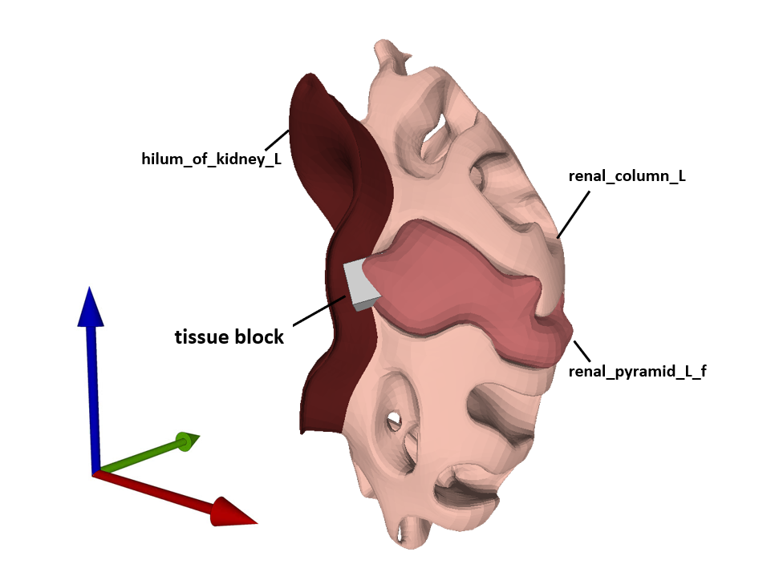

#  Preview: CCF Tissue Block Annotation: Mesh-Level Collision Detection

HuBMAP Atlas Previews demonstrate functionality and resources that will become available in future HuBMAP portal releases. Previews may rely on externally hosted data or analysis results that were generated with processing pipelines that are not yet integrated into the HuBMAP data infrastructure.

### Description

This preview presents a real-time mesh-level collision detection between tissue blocks and anatomical structures, see paper on "[Real-time spatial registration for 3D human atlas](https://doi.org/10.1145/3557917.3567618)". 

3D geometry-based tissue block annotation project includes: 
1. a C++ library for http service for collision detection and intersection volume computation between tissue blocks and anatomical structures 
2. a C++ library for checking manifoldness and closedness of meshes as well as hole filling for the unclosed meshes.   
3. a Python library for converting glb files to off (Object File Format) files, which is the underlying 3D model format for collision detection.

### Atlas Details

HuBMAP aims at developing a 3D atlas of human body consisting of organs, vessels, tissues to singe cells with all 3D spatially registered in a single 3D human atlas using tissues obtained from normal individuals across a wide range of ages. A critical step of building the atlas is to register 3D tissue blocks in real-time to the right location of a human organ, which itself consists of complex 3D substructures. The complexity of the 3D organ model, e.g., 35 meshes for a typical kidney, poses a significant computational challenge for the registration. We propose a comprehensive framework **TICKET** (**TI**ssue blo**CK** r**E**gis**T**ration) to support tissue block registration for 3D human atlas, including (1) 3D mesh pre-processing, (2) spatial queries on intersection relationship and (3) intersection volume computation between organs and tissue blocks. To minimize search space and computation cost, we develop multi-level indexing at both the anatomical structure level and mesh level. Considering cuboid based shape of the tissue block, we propose an efficient voxelization-based method to estimate the intersection volume. Our experiments demonstrate that the proposed framework is efficient and practical. **TICKET** is being integrated into the HuBMAP CCF registration portal.

### Experimental Data Details

Experimental data contain 3D organ models from [CCF 3D Reference Object Library](https://hubmapconsortium.github.io/ccf/pages/ccf-3d-reference-library.html) and tissue blocks registered in [HuBMAP CCF Exploration](https://portal.hubmapconsortium.org/ccf-eui).

### Contributors

**3D Organ Models:** Kristen Browne, Heidi Schlehlein, Bruce W Herr II, Ellen M Quardokus, Andreas Bueckle, Katy Börner

**Tissue Data:** Bruce W Herr II, Andreas Bueckle, Devin Wright, Katy Börner

### Attribution

| Group  | Creator                            |
|--------|------------------------------------|
| MC-IU  | Lu Chen (lu.chen.3@stonybrook.edu) |
| MC-IU  | Bruce W Herr II (bherr@indiana.edu)     |
| MC-IU  | Andreas Bueckle (abueckle@indiana.edu) |
| MC-IU  | Fusheng Wang (fusheng.wang@stonybrook.edu) |
| MC-IU  | Katy Börner (katy@indiana.edu)     |

### Visualization

